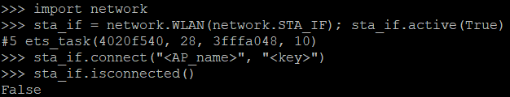
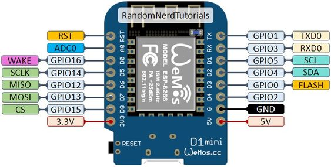

# Latebird Client

## Intro

> Welcome to DnA's geekiest quiz! 

In order to participate in the quiz, you first have to build your answering console from scratch.

In front of you are:
- Wemos D1 Mini WiFi microcontroller
- Cable
- Breadboard
- Connectors
- 4 Buttons

## Instructions

https://www.instructables.com/The-Super-Easy-Micropython-ESP8266-Guide-No-Guessw/

1. Install python

Get it from [GHD software](https://mckinsey.service-now.com/ghd?id=mck_app_cat_item&sys_id=f13b9e1fdb55bf00c6722dcb0b96193b&class=pc_software_cat_item&utm_source=ghd_website&utm_medium=web&utm_content=search_results)

2. Install esptool

Open command prompt in the correct folder by navigating to the folder in file explorer and typing `cmd` in the address bar


In the command prompt, type:

```cmd
py -m pip install esptool
```

3. Plug in board and find serial port

Press Windows key, type `device manager` and look for `Ports (COM & LPT)`.
Open the drop-down menu and check if the board is connected to `COM3` or `COM4`.

4. Flash firmware onto board

Plug in board, go to command prompt and type:
```cmd
py flashfirmware.py
```

The program will ask which serial port the board is connected to. Type in the correct port.

5. Install putty

Get it from [GHD software](https://mckinsey.service-now.com/ghd?id=mck_app_cat_item&sys_id=5d6f99dddbf80f80b332f3561d961947&class=pc_software_cat_item&utm_source=ghd_website&utm_medium=web&utm_content=search_results)

6. Connect to board

- Set connection type to `serial`
- Type in the correct serial port 
- Set speed to 115200
- Press save for future connections


Once connected, press enter and type `help()` to see if the board is working properly.


**If you are the first to finish this step, raise your hand to get a bonus point!**

7. Connect the board to WiFi

Copy the commands shown in the output of the `help()` command, replacing:
- <AP_name> with the WiFi name
- <key> with the WiFi password



If done correctly, the output of the final command should be `True`

8. Launch WebREPL on board

First type `import webrepl_setup`, then `E` and then choose a password.


After rebooting, the board will display two IP addresses.


- The first ip is on the network hosted by the board
- The second ip is on the WiFi network, use this one

9. Open WebREPL and connect to board

Open [WebREPL](./webrepl-master/webrepl.html) and type in the ip address you got in the previous step.
Press connect and input your password.


10. Upload boot.py & reset board

Upload `boot.py` to automate the steps you just completed (connecting to WiFi and launching WebREPL).
After uploading the file, press the `Reset button on your board` and reconnect via WebREPL.

Note that the reset waits for 10 seconds to ensure the WiFi connection is stable.

11.  Upload and run test file

Upload `main.py` located in the `test` folder. Then reset the board.
After some time, the board's LED should start blinking.

**If you are the first to finish this step, raise your hand to get a bonus point!**

12. Build basic circuit



13. Configure & upload real main.py

14. Play quiz